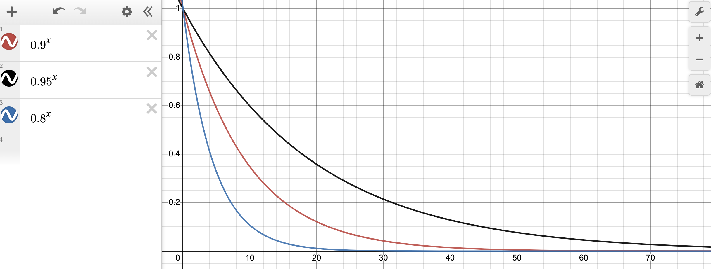
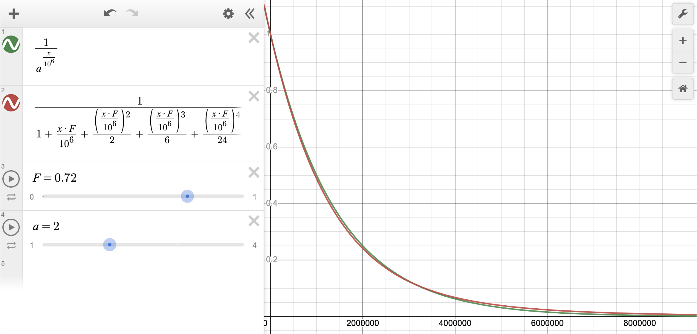
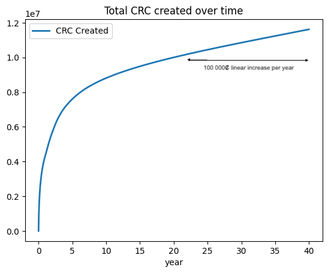
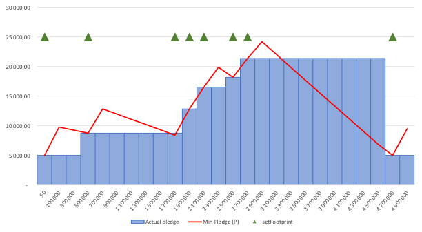

# Proof of Climate awaReness whitepaper
*Author: Guénolé de Cadoudal - for Credit Agricole CIB and Skandinaviska Enskilda Banken - March 2023*   

From the year 2021 we have seen an increase of the financial sector adoption of the public blockchains to host financial instruments and to operate their ownership transfer against cash instruments (CBDC, Stable coins ...).

Large institutions, public and private, around the world, are investing and are pushing their market to invest in the blockchain sector, considering that the blockchain technology can become progressively a substitute infrastructure for the financial market.

Indeed, public blockchains are a form of IT infrastructure run by parties with motivations independant of the infrastructure usage.   
This paper is not about discussing the history and background of blockchains, but let's just remind ourself the core principle of a public blockchain:     
**Blockchain operators run consistently an IT system that respects a consensus algorithm because of their self interest in earning a crypto token they can sell to the highest bidder**.     
This is the main incentive that enables the network of nodes to cooperate and create a resilient, censorless, decentralized cloud like infrastructure.

In this paper we propose a new consensus for a new public blockchain that embeds an incentive to improve the climate impacts of the underlying IT infrastructure.  

## 1. The problem to solve

Human civilisation is in an era where the ecological impacts of its activities has become a growing concern and this concern is becoming a driving force for multiple policies. These policies are helping but they are often hindered by the additional financial costs that positive ecological impacts requires.   
Human behaviour is often driven by self interest that sometime coincides with the common interest but sometime doesn't. And it appears that in the ecological situation the global interest is often not aligned with self interest (e.g. reducing the $CO_2$ the civilization emits needs that any company invests in alternative energy sources for no additional short term financial benefits).

In the sole scope of IT infrastructure, the demand for storage, network and computational power is increasing and IT services requires energy, rare materials and often uses hardware insufficiently recycled. If research and development exists in improving the ecological quality of the infrastructures, we believe it could be incentivized.

Blockchain technologies, concretized by Satoshi Nakamoto with bitcoin, and continued by Vitalik Butterin with Ethereum, and many others since, have leveraged self interest of individual to create a greater good in the form of a shared IT distributed infrastructure used to securely transfer value and run computational and storage logics with no central authority.     
The self interest here is the earning of a new form of assets (called crypto currencies or tokens) that obtain a monetary value when sold to those who needs it to use the IT infrastructure it powers.

This paper will not document, nor explain, the fundamentals of a public blockchain and the readers are directed to the 2 most relevant whitepapers for Bitcoin[^1] and Ethereum[^2]. Plenty of litterature exists on this subject and the reader is expected to understand the principles that construct public blockchains.    
However, let's make a focus on the consensus algorithm that drives blockchain infrastructures. Such algorithms are designed as a set of rules that all individual parties (nodes) in the network must be able to follow independently to process users requests (transactions); propose new blocks to others nodes and validate new blocks from other nodes. It is the collective behaviour of the individual actions that form the network and the infrastructure and it generally takes the form of a competition. 

[^1]: https://bitcoin.org/bitcoin.pdf
[^2]: https://ethereum.org/en/whitepaper/

The most commonly known consensus is the `Proof of Work` (Bitcoin, Ethereum, *before the Merge*) where any node is allowed to propose a new block as long as the block has a coherent structure (linked to the head of the chain, valid transactions ...) and has a valid hash below the *difficulty* that implies a lots of computation. If very robust, the proof of work consensus has a very negative image due to the very high level of energy consumption that nodes must put to participate into the competition of building blocks (The Energy Consumption of Blockchain Technology: Beyond Myth[^3] ). Beyond the image there is a reality that such technology is not sustainable. Without denying that multiple actors in the PoW space have invested in greener source of energy, it still remains that this produced energy is not very efficiently used.

[^3]: https://link.springer.com/article/10.1007/s12599-020-00656-x

Ethereum has migrated its consensus to the `Proof of Stake` (the *Merge* in 2022) and other public blockchain are already running on such protocol (Tezos, Polkadot, Hedera). In proof of stake the energy consumption is strongly reduced since the competition to create the block is replaced by a pseudo-random selection of the node based on their stake of crypto tokens. Hence the need for redundant calculation of finding a valid block is removed from the consensus lowering the energy consumption by a 100 thousand factor. 

Proof of Stake is indeed a huge progress, yet there is no incentive for the nodes to optimize their energy consumption and use computing hardware that search for sustainability.

This whitepaper proposes a design for a new consensus that intends to incentivize the operators of nodes to select the best possible ITsetup to run their system and enter into a competition for continuous improvement of their hardware, not only for the energy consumption but also in the ecological impact of the full lifecycle of the infrastructure they choose to use while producing the same service as an Ethereum public blockchain. 

**We call this consensus the `Proof of Climate awaReness` or `PoCR`.**

## 2. The mechanic for incentivizing environmental footprint reduction 

Nodes will make efforts in improving the environmental footprint of their IT infrastructure if they are given a financial incentive to do so.   
The **Proof of Climate awaReness** consensus therefore aims at aligning the crypto token earning of a node operator with the quality of the environmental footprint of its infrastructure.   
This implies that the nodes can prove the level of carbon emission of their infrastructure to the rest of the network in a trustable and public way.   

The PoCR consensus intends to put the nodes in competition for a better environmental footprint such that **the lower the footprint, the higer the earning**, and the absence of progress on the environmental footprint would progressively reduce the earning as others becomes better.   

The earning will be denominated in the native crypto token of this new public blockchain (the Climate awaReness Coin, CRC, ₡) and therefore, like any other shared infrastructure, the tokens will gain a monetary value by the increased usage on the infrastructure. So the earning of a node will be higher if the node can demonstrate to be running with a better setup than other nodes.

We need to introduce here the notion of ranking of nodes based on the environmental footprint of their infrastructure. Like in a race, where the first receives a larger reward than the second and the second a larger reward than the third, ... the best node is better rewarded than the second and so on.

The competition between the nodes will push the actors to favor better ecological equipments and progressively all nodes will be incentivized to improve their environmental footprint by getting these equipments. This global improvement should not stop the competition but set new challenges. When a node improve its footprint it can gain one or several places in ranking, earning more while the others start earning less. 
Therefore, we can look at the set of nodes like a never ending race where gaining a place over someone else is already an improvement and simply participating is contibuting to the overall setup. 

Will we reach a zero footprint impact ? If so we would have achieved something good : An IT infrastructure that has no negative impact on the planet ! But we are not there yet...   

Note that we should exclude carbon compensation scheme in the measurement of the node without preventing actors to compensate if they wish to do so. 

Will the total environmental footprint of such a network be better than other blockchains ? This is difficult to state today and it will largely depends on the number of nodes (as the total impact is the sum of each node individual impact).     
Will the total environmental footprint be better than a centralized system ? Maybe not, initially, but it offers a decentralized and business agnostic service that no centralized approach can offer.    
In any cases, the base global environmental footprint is likely to be similar or smaller per nodes than a Proof of Stake or BFT consensus as it starts on the basis of a proof of authority.

## 3. Calculating the environmental footprint of a node

Let's detail now how the environmental footprint of a node is calculated, recorded and shared in a trustable manner and usable to reward the node. 

An IT solution cannot (yet?) determines by itself the energy, $CO_2$ emmission, and other environmental factors (water used, rare materials) that it has a need for. Therefore the nodes will need to rely on the expertise of external parties to assess their infrastructure. 

First, the research suggests that a large part (30 to 40%) of the environmental impact of IT infrastructure comes from the construction and shipment of the hardware before it is even first used according to greenit.fr report[^4]. Another important part is linked to the management of the end of life of the equipments after it has been put out of use. So it is critical that the node assessment is done on the full lifecycle (construction, shipment, installation, usage, end of life) of the various parts that constitute a node : computer hardware, storage units, network appliances, cooling systems, electricity sources etc.

[^4]: https://www.greenit.fr/wp-content/uploads/2019/11/GREENIT_EENM_etude_EN_accessible.pdf

Then, it is important that we can apply consistently the same assessment methodology across all nodes, across multiple data center and geography, and across time. Such a methodology must therefore be designed by experts in this field of the industry and follow a well recognized standard.   

Typically, the environmental footprint of a node will be measured with multi-criteria climatic impact indicators following the IPCC 100 years methodology[^5] and the Life cycle assessment[^6] approach and be expressed in $kg.CO_2$ equivalent and in accordance with the ISO 14040/44:2006 standard.

[^5]: https://www.ipcc.ch/site/assets/uploads/2018/02/ar4-wg1-chapter2-1.pdf
[^6]: https://eplca.jrc.ec.europa.eu/lifecycleassessment.html

The methodology defined for assessing the environmental footprint of a node is to be considered as a part of the whitepaper and must be adhered to by all nodes. The full documentation of the methodology is documented here[^7].

[^7]: https://github.com/ethereum-pocr/whitepaper/blob/main/LCA%20assessment%20methodology%20-%20v1.0.pdf

The methodology is created by APL Data center and relies on the NEGA OCTET[^8] database, a joint effort sponsored by the "Agence de l'Environnement et de la Maitrise de l'Energie" ADEME[^9].

[^8]: https://negaoctet.org/en/home/
[^9]: https://www.ademe.fr/en/frontpage/

As an abstract, let's consider the below diagram.

A node operator, in charge of the IT infrastructure needed to run its node in the network, will identify and provide the listed inputs (Datacenter elements and IT Equipment data) to the Auditor. The Auditor will apply the allocation rules and the indicators from the environmental database (Nega Octet) to calculate the environmental impacts in terms of the four indicators ($C0_2$ emission, depletion of natural resources, primary energy consumption and water resource depletion). These indicators are then normalized and added together to form the Environmental Footprint of the node whose value has no unit but faciliate the comparison accross the nodes. 

Since nodes themselves, as IT software cannot self assess their environmental footprint, since there are financial implications (the blocks rewards and transaction fees) in making this assessment, node owners cannot be trusted to self assess their nodes either. So external trustable parties, with at least their names at stake, should be entrusted to analyse the nodes setup.    
As it is important to maintain, as much as possible, a distribution of roles and avoid unique actors and centralization, such parties must be multiple and remain independant and in competition. These parties will be refered to as `node auditors` or `environmental footprint node agencies` with a role similar to rating agencies in the financial sector. 

These node auditors will be mandated by the node owner to assess their IT infrastructure and must follow the defined methodology and be in a position to demonstrate that the methodology has been followed. Once an assessment is done on a node, they will record in the Blockchain the environmental footprint of the node under their signature (i.e. making a blockchain transaction with their representative private key). 

Given that the result of an audit is a fixed number (a environmental footprint indicator), nodes operators may find convenient to not perform audit of theit IT infrastructure often enough. Although, not re auditing a node let other nodes operators better their own setup and receive better reward, it appears useful to incentivize further the node operators to regularly audit their node. The consensus therefore apply a penalty on the node that have not been audited for some time. See section 5.1.

Only conformant auditors will be authorized to record the result of an audit in the chain. The community of node owners have the possibility to vote in or out an auditor with a majority + 1. Auditors will be encouraged to review the audits of their peers and expose any wrong doing as they are in competition with each other with the nodes as customers.    
In order to futher enforce auditors quality auditors have to set an amount of crypto tokens at stake before being allowed to record the result of an audit.    
If an auditor is voted out by nodes it will loose all it's stake.    
If an auditor decides to redeem its stake, it can only do so only after a period of 3 months (1 971 000 blocks) following it's last audit, giving enough time for external actors to eventually control and expose the auditor.    
The amount at stake is function of the number of audits performed, the time since the audit to also act as a "capital requirement" for the auditor to perform its duties (see following sections). 

Node owners identity will have to be publicly known and be transparent to the community. They cannot be also auditors as it would possibly create a conflict of interests.   
The identity of the node owners should be known because the auditors will need to collect documentation and data and ensure that these are the actual figures of the nodes. 
The identity of the node owners are also expected to be public to enable public display of the nodes activities and the origin of the crypto token created. Finally, as we will see in the next section the identity of the nodes will be important to decide allowing a new member in the group of block builders. Although not a technical requirements, nodes are expected to only approve new nodes that are companies under supervision by a regulatory body.

## 4. Deriving from the proof of authority consensus

This new blockchain wants to offer an alternative to the market by being a public "greener blockchain" that has also a good throughput compare to existing public blockchains. The financial sector, in particular, and many large corporate businesses are looking for such a blockchain since they have taken ESG commitments and they cannot afford to have their name linked to an energy intensive infrastructure.     
In addition, they are regulated and must be in a position to respect Anti Money Laudering and Counter Terrorism Financing rules and therefore need to be in a position to demonstrate they are using a crypto token which source is tracable.   
The regulated markets have difficulties to accept working on public infrastructures where the crypto token can fuel unknown actors that would potentially be suject to sanctions or linked to illegal activities. Therefore, there is a need for an open, public, shared, non centralized infrastructure that only involves "regulatory conformant" actors .   

The `proof of authority` consensus is designed to only allow a known set of nodes to create blocks. In particular the clique[^10] implementation proposed in EIP 225 of the Ethereum community, defines a replacement for the `proof of work` consensus that would be a good base to implement the `proof of Climate awaReness` consensus.

[^10]: https://eips.ethereum.org/EIPS/eip-225

In the clique consensus, nodes are identified by an ethereum address corresponding to the private key they will sign their blocks with. Nodes do not receive rewards for creating blocks and they are not put in competition. The list of authorized nodes (addresses) are simply requested to create blocks, in turn, at a regular frequency. In this consensus, nodes are called `sealers` as they simply apply their signature on a block. The other nodes receiving this newly created block will verify that the block is valid and that the sealer is legit, before adding it into their copy of the chain. If the next expected sealer did not send a block in the given timeframe, any node is allowed to take its place, ensuring redundancy in case of a node failure.

At the genesis of the chain, a single sealer is enough. It can allow new sealers in the consensus by voting in its address. Each new sealer needs to be voted in by at least $N/2 + 1$ existing sealers, $N$ being the total number of authorized sealers. Similarly, a node that is not acting appropriately in the consensus can be voted out by at least $N/2 + 1$ nodes to be excluded from the consensus.

To ensure that a node cannot seal a long consecutive set of blocks, and control the chain, there is a rule in clique that prevents a sealer to seal another block until at least $N/2$ blocks have been sealed. So in a 10 nodes setup, node `#1` will at best be able to seal block $B$, then at the earliest block $B+10/2 = B+5$.

We would reuse this behaviour and give a financial reward to the sealers making blocks based on their environmental footprint ranking and on the number of nodes involved. The reward should deliver an incentive to improve their individual environmental footprint and at the same time should ensure that accepting more nodes in the the consensus is not penalizing any node, to avoid a too small group of nodes. Finally, once sufficient activity has peaked up on the network the transaction fees should replace the block reward to limit the crypto currency creation to a predictable amount.

On this last element, controlling the block reward level based on the chain activity, means here to use the transaction fees as an alternate source of earning. The Bitcoin network has taken the view that progressive usage of the network will enable the halving of the block reward while maintaining enough miner reward with the tx fees. Ethereum consensus (prior to proof of stake) has a more interventionist policy on the block reward (e.g. difficulty bombs).

## 5. Calculating the reward of a node and the incentive scheme (Tokenomics)

Based on the above discussion, the reward of block `b` for a node `n` will be made up of 3 parts to control the 3 incentives, a minimum token creation and the transaction fees: 

$$ SealingReward(n,b) = CarbonReduction(n) * AcceptNewSealers() * GlobalInflationControl(b) $$

$$ Reward(n, b) = Max(SealingReward(n,b),MinReward()) + TransactionFees(b, n) $$

### 5.1. Ranking the nodes based on their `Environmental Footprint`

As seen above each of the nodes have to have been audited to receive a reward in participating to the consensus.   
Without an auditor setting the environmental footprint, $F_a(n)$, then $F_a(n)=0$. This value comes from the governance smart contract and is set bt the auditor as part of the audit process. With this value, the block at which the audit was recorded is also stored and it will be referred to by $B_F(n)$.

In order to apply a penalty on nodes that are not regularly audited (once a year), the environmental footprint actually used for the rest of the consensus is adjusted by applying a 5% increase per years without audit.

$$ N_{year}(n) = {b - B_F(n) \over (3600 / 4) * 24 * 365}$$
Where $b$ is the current block number, the divider represents a year worth of blocks and the division used is the euclidian integer division, implying that less than a year gives $N_{year}(n) = 0$. Then,
$$F(n) = F_a(n) . { 100 + 5.N_{year}(n) \over 100} $$

The ranking of the nodes $R(n)$ is based on the the Environmental Footprint of the node $F(n)$ and is calculated as follow:

$$ R(n) = \sum_{k=1}^N l_k(n) $$ 

Where $l_k(n) = 1$ when $F(k) < F(n)$ and $l_k(n) = 0$ when $F(k)≥F(n)$ or $F(k) = 0$.  

With this formula, the best node (the one with the best environmental footprint) will have $R(n) = 0$ since no other node has a better $F(k)$ than $F(n)$, the next node will have $R(n)=1$ and the last $R(n)=N-1$, $N$ being the number of nodes with a positive environmental footprint.   
If there are equality between $p$ nodes they will have the same rank $r$ but the one directly following them will have the rank $r+p$ and not $r+1$.

To be noted that the value $F(n)$ is a positive number (any carbon compensation setup would be ignored and an assessment of environmental footprint that would be negative wouldn't make sense). A node with a zero environmental footprint is considered having not been audited and will not be included in the ranking nor will it receive any reward as a consequence.

### 5.2. The `CarbonReduction` base reward

The above ranking logic places each node in a cohort of nodes based on the quality of its environmental footprint (a value expressed in integer with no unit with no decimals).   
The node with a very good environmental footprint should be receiving a larger premium than one with a good one who in turn receives a better premium than some node with a average or even bad footprint. The intention is not to make this additional footprint linear since in technology, important breakthrough are often much more difficult to get than incremental improvement. Therefore an exponential decay curve $f(r) = \alpha^r$ seams adequate, where $0 < \alpha < 1$ and $r ∈ ℕ$, is the rank $R(n)$ of the node $n$ in the cohort with integer values $R(n) ∈ [0, N-1]$ and $N$ is the number of nodes.

We define the Climate awaReness Factor, $CRF(n)$, as 

$$ CRF(n) = \alpha^{R(n)} $$

We set $\alpha=0.9$ as an assumption that the number of nodes in the network will be around 40 to 50. 

In the diagram, the abscissa axe shows the rank $R(n)$, and displays two other options with $\alpha=0.8$ and $\alpha=0.95$. The ordinate axe show the result of $\alpha$ raised at the power of $R(n)$.     

Since $R(n) ∈ ℕ$, $0.9^{R(n)}$ can be calculated as a quotien of integers as follow

$$ 0.9^{R(n)} = {{9^{R(n)}} \over {10^{R(n)}}} $$

To ensure rounding as late as possible in the computer calculation and applying the Euclidian division[^11]. Note, the calculation can be pre-calculated or cached as it does not depends on the block number.

[^11]: https://en.wikipedia.org/wiki/Euclidean_division

Finally, with $₡$ representing a unit of Climate awaReness Coin 
$$CarbonReduction(n) = CRF(n) * 1 ₡$$

### 5.3. The `AcceptNewSealers` factor

Here the logic is to give to the early joiner nodes to get an incentive to accept new nodes n the consensus.    
With the proof of authority consensus, each allowed nodes are expected to seal a block in a round robin way (each in turn). So, given that the blocks are created every $s$ seconds (set to 4 seconds in this whitepaper) it means that when new nodes are brought into the game, the average reward per unit of time will drop for the existing nodes.   

A node $n$ within $N$ nodes will earn $x₡$ every $N$ blocks or $x/N$ per $s$ seconds.  

When a new node is added into the consensus, the total number of nodes becomes $N+1$ and the the node $n$ will now earn $x/(N+1)$ per $s$ seconds . 

Therefore the node loses $x * ({1 \over N} - {1 \over {N+1}})$ per block when the network moves from $N$ nodes to $N+1$ nodes. 

Adding yet another node (total $N+2$ nodes), node $n$ will now earn $x * 1/(N+2)$, loosing $x * ({1 \over N} - {1 \over {N+2}})$ per block compared to when the network has $N$ nodes. 

A node needs to earn a fixed amount per unit of time as its operating costs will be stable in time regardless of the number of nodes. Since the earning is only delivered when the node seals a block, the block reward should deliver the same quantity independantly of the number of nodes. So $E_N(n, b)$ being the earning of node $n$ at block $b$ with $N$ nodes we have the equality

$$ E_N(n, b) = E_{N+k}(n,b) $$
$$ \equiv { AcceptNewSealers_N()*x \over N} = { AcceptNewSealers_{N+k}()* x \over {N+k}} $$
This is only possible if $AcceptNewSealers()$ is the actual number of nodes $N$ and $N+k$
$$ \equiv { N*x \over N} = { (N+k)* x \over {N+k}} $$

Conclusion:

$$ AcceptNewSealers() = N $$

### 5.4. The `GlobalInflationControl` factor

As said previously, the bitcoin network proposes a halving mechanism that divide by 2 the earning every fixed amount of blocks and therefore cap the total number of bitcoins ever created.

This scheme has a lot of benefits but two inconvenients we wish to cover in this consensus.

First, at the time of the halving, miners suddently receive half of the earning creating an economic incentive to either increase the bitcoin resell price or stop mining as the earning becomes lower. To resolve this we put in place a 'continuous halving' or better named 'reduction factor'. Also, the bitcoin uses the number of blocks as a measure of monetary creation because the bitcoin creation is fixed per block. In the Proof of Climate awaReness consensus the quantity of CRC is not fixed per bloc but depends on several factors (number of nodes, ranking of the nodes). So we prefer using the quantity of created CRC as a control of the reduction factor.

The second element is the consequences of lost bitcoins that can never be retrieved (sent by mistake to address without private key, lost private key of address with bitcoins ...). This reduces in practice the actual quantity of bitcoin effectively in circulation. To resolve this we put in place a 'minimum CRC creation' that will compensate for the statistical destruction of CRCs.

1. In bitcoin, the reward $R_B$ for the bloc $B$ is defined by 

$$ R_B = 50 *{ 1 \over 2^{B÷210,000} } = 50 * f_B $$

Where $÷$ symbol represented the integer euclidian division so that below 210,000 $B÷210,000 = 0$ and $220,000÷210,000 = 1$ etc.

Similarly, in the Proof of Climate awaReness consensus the reduction factor at block $B$ is calculated as 

$$ f_{b+1} = {1 \over { 2^{M_b / {10^6 } } }}$$

Where $/$ symbol is the continuous division and $M_b$ the quantity of CRC created at block $b$.   
Because in computing calculation the continuous division produces floating values that depending on implementation language, compilers and processors may not gives exactly the same rounding, it is not possible to ensure consistent results accross all nodes and therefore validate the blocks efficiently. So to cover this issue, we will use the limited development formula of the $e^x$ function adjusted for $2^x$.

So, 

$$ f_{b+1} = {1 \over { { 1 + { 0.72M_b \over 10^6} + { [{0.72M_b \over 10^6}]^2 \over 2} +{ [{0.72M_b \over 10^6}]^3 \over 6} + { [{0.72M_b \over 10^6}]^4 \over 24} } } }  $$

Simulation shows that with this regime it will take 20 years to reach 10 million ₡ with 35 nodes, most joining in the first 5 years. 

1. To cover for the *Irretrievably Lost* tokens (estimated at 4% of the total supply every year in bitcoin[^12]) we propose to set a minimum cap at 100 000 ₡ created per year or 0,01268... ₡ per block that represents 1% of the 10M₡. 

[^12]: https://static1.squarespace.com/static/5d580747908cdc0001e6792d/t/5e98dde5558a587a09fac0cc/1587076583519/research+note+4.17.pdf

Finally:

$$GlobalInflationControl(b) = f_{b}$$

$$ MinReward() = {100,000 ₡\over {365 * 24 * 3600 / 4} }$$

The chart represents the total amount of crypto created by years with 30 nodes joining in the first 5 years and the total number of nodes reaching 40 after 20 years 

In the implementation of the consensus it is necessary to store the total quantity of CRC generated after each block to have the value $M_b$ in the formula of $f_{b+1}$.   
This information is stored in the chain state at address `0x0000000000000000000000000000000000000101` and key `keccak256('GeneratedPocRTotal')` = `0x7811a2bc735fc5403fbfc32e2acc5672667b529348616ff7d9fbcfb25c7d529a`.    
Thanks to this storage the CRC is part of the state and therefore secured in the state root (the root hash that is part of the block header). Also, any blockchain observer is able to read the current quantity of CRC.

### 5.5. The `TransactionFees` earnings

As seen in the above paragraph, the sealer reward will decrease with the quantity of token created. In parallel of the initial period of high block reward the network is expected to develop and users will start using the blockchain for business activities and making transactions.

Transactions on the network are paid in CRC according to their computing and storage complexity expressed in units of $gas$. A user submitting a transaction can decide the price he/she is ready to pay per unit of $gas$. This defines $TxFee = G * P_{gas}$ where $G$ is the amount of gas needed for the transaction and $P_{gas}$ the unit price of $gas$.

The user's wallet is debitted of the $TxFee$ and the sealer of the block including that transaction receives the $TxFee$ (modulo the evolution of the EIP-1559 that is potentially applicable on the network).

So the $TxFee$ acts as an additional earning for the searlers, and when the sealing reward decrease the sum of $TxFee$ should progressively replace the sealing reward. 

If the $TxFee$ is given as spent to the sealers, then there will be no earning difference between sealers according to the quality of their environmental footprint. This will strongly impair the principal competition incentive of the Proof of Climate awaReness network.

To maintain the incentive the sealer $n$ will only receive $T_n(t)$ a portion of the $TxFee$ for transaction $t ∈ ℕ$ corresponding to its ranking $R(n)$ as at the previous block.

$$ T_n(t) = TxFee(t) * CRF(n)$$

So applied to all transactions $t=1..P ∈ ℕ$ integrated in the block $b$

$$ TransactionFees(b,n)= CRF(n) * \sum_{t=1}^P TxFee(t) $$

We recall that $0 < CRF(n) ≤ 1$, so some of the CRC spent by the users are destructed (burned) in the process, reducing the total quantity of CRC $M_b$ of that amount.   
The `GlobalInflationControl` will ensure that enough CRC remain in circulation despite this destruction.

## 6. Network capacity

In the proposed model, the quantity of crypto currency issued in the network will reach a linear monetary creation of 100 000₡ per year.    
Unlike the bitcoin network, there will be not hard stop of producing the crypto currency. 

The CRC tokens have the intrinsec value the blockchain users will give. The purpose of the CRC is to be an utility token for paying the services of the decentralized infrastructure offered by the blockchain network.

The capacity of the network will be limited by the maximum number of transactions such PoA based network can accept in a given period of time. Based on similar setup (Binance Smart Chain) that can reach 340 transaction/s (TPS) or ~30M transactions per day[^13] with a block limit of 119 MGas[^14] and a block time of 3 secs.   

[^13]: https://bscscan.com/chart/tx
[^14]: https://bscscan.com/chart/gaslimit

With the PoCR Network, that has a 4 sec block time and 119 MGas limit (set in the genesis block), we could be in a position to reach **~255 TPS** or **22M transactions per day**.

Because of this technical limitation of the quantity of services (processing transactions) the network has to offer in a given period of time, the spending of CRC will be limited and the demand for CRC will be aligned. 

## 7. Monetary policy of the crypto currency

With all the above, we consider that in order to keep the price of the CRC relatively stable with time the quantity of CRC in circulation (Total CRC generated less the *Irretrievably Lost* CRC) should remain stable since the maximum services offered will be fixed.

If the network is under utilized, the user's demand for CRC will be lower and the CRC sell price will lower. The node operators will therefore be incentivized to increase the number of CRC needed per unit of gas (`--miner.gasprice` option in geth initially set to 1 GWei of CRC) to receive enough CRC to cover their operational costs. This will increase the demand of CRC for the same amount of transactions, stabilizing the price.

Node operators should however be carefull not to bring the price of gas too high (and they are in competition for this) as they will not accept transaction that do not pay enough, loosing at the same time the possibility of earning transaction fees.

If the user's demand for transactions goes above the capacity of the network, there will be competition between the users to get their transaction in the blocks and this is going to increase the gas price proposed by the users, as sealers will prioritize transactions with the highest fee. This will push the CRC price up due to demand being higher than offer up to the point where the price will be too high to equal the intrinsec value of the service (and user will turn to an alternate solution).

Speculation is another element that influence the market price of an asset and crypto tokens have been subject to this influence a lot (too much). At the time of writing the whitepaper it is the intention of the authors to minimize the impact of the speculation on the price, but it is understood that speculation provides a service to any market (liquidity, risk transfer) but too much speculation will impair the users and sealers in the network. The CRC is not intented to be an investment asset (unlike BTC or ETH have become) but the authors wish to maintain the CRC as a utility token which price measures the value of the blockchain service.   
At the launch of the network, the initial sealers do not intend to provide CRC to exchanges to keep some influence on the price, but as soon as the network grows it will become necessary for the sealers and users to have a market place to sell and buy the CRC between them and speculation may arise.

The monetary policy of the CRC is not defined by any particular actor. It is initially set in this whitepaper, as a starting point based on hypothesis and the experience of other networks, but the distributed governance of the network (defined in the following sections) can decide changes in particular the following parameters

* Network capacity : block size (in gas) and block time
* CRC creation:  GlobalInflationControl and MinReward

## 8. Intialization and governance of the network
### 8.1 Initialization
The genesis of the project is the constitution of a blockchain that can serve the purpose of hosting a "green bond" issuance in a public blockchain by an issuer. 

The blockchain, based on the Proof of Climate awaReness consensus, as described above, has the potential of being useful for many other use cases where sustainability is an important requirement. Also, the bond being issued will need to live its entire life onchain for 3 to 5 years which leads to the need to have the network last long enough.

In the long run, it is probably not the role of banks to be running the blockchain infrastructure but more probably to simply be users of such a shared infrastructure.

Initially setup with 2 banks, the network will have 4 nodes in the consensus. Being based on a proof of authority scheme, a single bootstrap node address will be hard coded in the genesis block then the other invited then the initial node removed. The bootstrap node will not receive any CRC.   
The second node will be allowed by the bootstrap node; the third one by the 2 first ones ( $1/2 + 1$ ); Then the bootstrap node will be removed from the consensus. Then, the 4th node will be allowed by the 2 remaining ones ( $2/2 +1$ ); and the 5th by 2 out of the 3 nodes ($3/2 + 1$).

Any consecutive node joining will have to be approved by at least $N/2 + 1$ nodes. So none of the two initial banks can decide alone who should join.

### 8.2 Nodes  
A node willing to enter the consensus will need to make itself known to the community and get approved by more than half of the community of nodes.    

A node entering the consensus will also need to be given a environmental footprint by one of the authorized auditors. It can sollicit one or several auditors to get a quote to have its node assessed and can get this assessment done at any time before or after entering the consensus. But the node will only start earning new crypto units or transaction fees after both steps are performed (being enrolled in the consensus and being given a environmental footprint).

Once a node is starting to earn crypto units it will naturally compare itself against the rest of the nodes to see if it can improve its setup and earn more crypto. It will then again sollicit auditors (the same or another one) to have new assessment of its node.

The process for a new node operator to join the consensus can be described as follow and all nodes already in the consensus are expected to accept this process as part of the principle of the consensus. This process can be amended with the a majority of the nodes and auditors (see 8.4 below)

1. Candidate node operator will fill a form (inside an issue[^15] ) that will be reviewed by existing node operators. The form should be complete enough so the candidate can be contacted and prove its identity via exposing its sealer address in a secure website.
2. Each existing node operator are expected to carefully review the request and assess, in good faith, without a protective approach, the candidacy. The node operator will in particular 
  * evaluate if the candidate is suitable for the purpose of running an infrastructure that runs regulated activities; 
  * if there is a genuine motivation to support the growth of the network.  
  * verify that the candidate is a company, not controlled by a company or person that also control another node
  * verify that the identity of the company candidating is genuine (via a secure website page that is certified for the company)
  * can ask question in the forum of the issue website to request clarification (transparency of the questions and answers are a sign of good faith)
3. Each existing node operator will take its individual decision by submiting the `clique.propose("sealer address of the candidate", true)` command to its own node.
  * All decisions should be applied in a period of one week, else all votes will need to be made again (this is to prevent never ending vote)
  * Not agreeing to the candidate is done by not voting for the candidate
  * Changing its vote is possible by submitting the `clique.propose("sealer address of the candidate", false)` command to its own node.
4. Existing nodes that do not apply the selection process in good faith can be pointed out by the community and the candidate. In the extreme case a mis behaving node operator can be removed from the consensus by half of the participants.

[^15]: https://github.com/ethereum-pocr/pocrnet/issues/new/choose

### 8.3 Auditors 
Environmental footprint auditors have therefore a central role in the setup and must be carefully choosen by the community of the nodes. At the initialization, the banks will invite an initial single auditor to bootstrap the process.     
The auditor will receive crypto units, precreated in the genesis block (including the necessary pledged amount - see below). With this the auditor will enroll itself as the first auditor in the PoCR governance smart contract initializing at the same time the mechanism for enlisting and excluding auditors.    

When an auditor wants to be granted the possibility to perform an audit, it will make himself known to the community requesting to be approved by at least half of the nodes + 1. Concretely it means that the auditor will perform a self registration on the PoCR governance smart contract, giving its address, and wait to receive enough votes ( $N/2+1$ ) by nodes that have already been audited. Nodes can vote only once with the address of their node but can change their vote at any time. Several auditors can be awaiting authorization at the same period. Once an auditor receives the last vote (last positive vote out of the N/2+1) the auditor is added to the authorized list.    

The process to follow for a new node auditor is similar to that of a new node operator. Nodes operators and auditors are expected to abide by this process as part of the principle of the consensus. This process can be amended with the a majority of the nodes and auditors (see 8.4 below)

1. Candidate node auditor will fill a form (inside an issue[^15] ) that will be reviewed by existing node operators. The form should be complete enough so the candidate can be contacted and prove its identity via exposing its auditor address in a secure website.
2. Each existing node operator are expected to carefully review the request and assess, in good faith, without a protective approach, the candidacy. The node operator will in particular 
  * evaluate if the candidate is suitable for the purpose of evaluating environmental footprint according to the defined methodology and the audit protocol; 
  * if there is a genuine motivation to support the growth of the network.  
  * verify that the candidate is a company, not controlled by a company or person that also control another node.
  * verify that the identity of the company candidating is genuine (via a secure website page that is certified for the company)
  * can ask question in the forum of the issue website to request clarification (transparency of the questions and answers are a sign of good faith)
1. Each existing node operator will take its individual decision by submiting on the governance smart contract the `voteAuditor("address of the auditor", true)` transaction to the network signed by the sealer address or a delegate address.
  * Not agreeing to the candidate is done by not voting for the candidate
  * Changing its vote is possible by submitting the `voteAuditor("address of the auditor", false)` transaction.
1. Existing nodes that do not apply the selection process in good faith can be pointed out by the community and the candidate. In the extreme case a mis behaving node operator can be removed from the consensus by half of the participants.

An auditor enlisted can be excluded by the community if at least $N/2 + 1$ nodes decide to vote its address out at any point (with the same transaction as above). Only nodes that have been audited and that have a environmental footprint can vote. Nodes can vote only once per auditors but can change their vote at any time. When the auditor has been voted away by at least $N/2+1$ nodes it is excluded from the authorized list making its capacity to set environmental footprint for nodes impossible.

An auditor can capture the environmental footprint of a node if it has pledged in the PoCR governance smart contract a minimum amount of CRC as a guarantee to the community that any misconduct can be sanctionned. When voted out an auditor cannot take its pledge back. An auditor can take its pledge back if it has not done an audit for more than 3 months (1 971 000 blocks at 4sec per block $= Span$ ).    
The amount that an auditor has to pledge should be substantial but also linked to the liability the auditor is taking. At the inception, since there is no crypto created yet, the amount should be preallocated to the first auditor (in the genesis block).    

A minimum amount $M_0 = 5.000 ₡$ should be secured for any new node assessment. The minimum amount necessary will decrease proportionally with the age of the last audit for the following 3 months. Specifically, if the auditor has last audited a node at the block $B$ and had an existing  pledge $M$, when it wants to audit a node at block $B+\delta$ then it must have at least 

$$ P = M * (1 - {\delta \over Span}) + M_0 ; \space when \space \delta < Span$$ 

$$P = M_0 ; \space when \space \delta > Span$$ 

Once this new audit is done $B$ becomes $B+\delta$ and $M$ becomes $P$ and the next audit will follow the same logic.    

This scheme implies that to satisfy an increasing number of clients over the same period of 3 months the auditor must pledge a larger amount. This designs a sort of "capital requirement" for the auditor that increase with the frequency of audit and therefore the quantity of business it does.      

The below diagram represents an example where an auditor perform several audits ($\triangle$) over a period of 5 million blocks. The blue bars represents the amount pledged at the block. The red line shows how the minimum pledge amount evolves over time. For instance, at block 4 700 000 the pledge was fully amortized so the minimum amount is only 5.000 ₡ and the auditor was able to redeem its pledge before performing the next audit. Another instance, at block 500 000, because of previous audit the pledge amount is 5 000₡, since block 50, then the minimum pledge calculates as $8.731₡ = 5.000₡ * (500000-50)/ 1971000 + 5.000₡$, hence the auditor only needs to pledge an additional 3.731₡ to be able to perform the next audit.

When an auditor is excluded by the community, the amount pledged by that auditor is confiscated. The community of nodes can decide to use the funds confiscated by the excluded auditors as they see fit by voting at $N/2+1$ like in a multi-sig wallet.

### 8.4 Changes requests "Climate awaReness Improvement Proposals"
Change in the consensus or the governance model can be agreed by the community by first having the change documented in the form of a memorandum posted in the community tool at https://github.com/ethereum-pocr/CRIPs (via pull request) and voted upon (positive or negative) by a majority +1 of voting nodes and a majority +1 of voting auditors. 

Both communities (nodes and auditors) should express their approval independantly to prevent changes that penalize one community against the other. 

Changes will be published as CRIP (Climate awaReness Improvement Proposal) in a form very similar to Ethereum EIP[^16]. They will be discussed by the community and put to vote after a minimum of 3 months (1 971 000 blocks of 4 secs) and for a maximum duration for voting of 1 month (657 000 blocks of 4 secs).

[^16]: https://ethereum.org/en/eips

## 9. Implementing the consensus

Important note: the consensus as defined in this whitepaper is not limiting implementation to any language or platform as to avoid concentration of responsibility and power. The below description intends to show the initial implementation.

The proposal is to use the existing proof of authority consensus implemented in go-ethereum and defined in EIP 225. The reasons for this choice are severals. 

First, the golang implementation represents a large part of the production nodes (71% according to ethernodes[^17] as of Feb 2023) and is known to be stable and maintained, close to the operating system (compiled language) and easy to deploy (no library).

[^17]: https://www.ethernodes.org/

Then, the clique consensus is implemented and follows the EIP 225. This corresponds well to the need of the node community that we wish to implement. The clique implementation is relatively simple to derive.

Finally, despite the fact that the clique consensus by default does not reward nodes, the code to set the reward can be inspired from the ethash consensus.

For the governance, the implementation needs a smart contract, the PoCR consensus smart contract, that will exist in the genesis block at address `0x0000000000000000000000000000000000000100`. This smart contract will hold the states for the nodes and their environmental footprint, the auditors authorized addressed, the auditors pledged amount, and the various rules for the governance (CRIPs, votes ...). 

For the reward and fee calculation, the PoCR governance smart contract holds $F(n)$, the environmental footprint of node $n$. The  $M$ value, the total amount of crypto created is held in address `0x0000000000000000000000000000000000000101`.    

At the time of sealing a block (`FinalizeAndAssemble()`) or at the time of verifying the block from another node (`Finalize()`), the engine will call a new method `blockPostProcessing()` that will
- ignore the reward calculation for the genesis block (block 0)
- identify the current block sealer address $n$ from the in memory or in block snapshot
- extract from the PoCR governance smart contract the values $N$, $F(n)$, $B_F(n)$, $F(k), k ∈ [1, N]$, $M$ 
- if $N$ is zero, no reward is given and the log shows that no node is recorded yet
- if $F(n)$ is zero, no reward is given and the log shows that the sealer has no environmental footprint yet
- calculates the ranking of the node $n$ taking in consideration audit age penalty
- calculates the $CarbonReduction(N, F(n), F(k))$ is calculated
- calculates the $AcceptNewSealers(N)$ : equals $N$
- calculates the $GlobalInflationControl(M)$ 
- the 3 values are multiplied using big int and added to the sealer balance and to the the smart contract balance and the $MinReward()$ is compared to the result to ensure that a minimum CRC creation is generated.
- The Transaction fees are adjusted according to the node ranking and any over perceived fees are removed from the sealer and burnt, also adjusting the total crypto generated $M$.
- The actual sealers in this new block, as per the clique consensus are synchronized in the Governance smart contract so the actual number of nodes and actual allowed nodes are correct for the smart contract logic.

The rest of the governance logic is classical smart contract logic that does not intervene in the reward mechanism and that can rely on the normal property of the EVM.

The Governance smart contract code is available to all for review in gihub[^18] and it has been audited by Intrinsec[^19]

[^18]: https://github.com/ethereum-pocr/ethereum-pocr.github.io/tree/main/sc-carbon-footprint/src
[^19]: https://github.com/ethereum-pocr/whitepaper/blob/main/PoCR%20Governance%20smart%20contract%20audit%20-%20extract.pdf

In all calculations defined in this paper the implementations should use big integer methodology instead of floating points approach. When large integers are to be divided, the calculation is maintained as a quotien of big integers and only resolved by the euclidian division as late as possible ignoring the remainder. 

## 10. Attack vectors and remediations

From the EIP 225 (Clique) the same attack vectors exists.   
Some propositions are in progress to cover some of these cases.

### 10.1. Governance takeover
It is technically possible that half of the node operators becomes controlled by a single actor who decides to exclude other nodes and become the sole or majority decider of the network. 

To mitigate that risk, nodes should be formally authenticated to a legal entity and the ownership control of that legal entity established prior to allowing its node in the consensus.     
Should a node operator being candidate to sealing is linked to another entity that already has a node then its candidacy should be rejected. Only one node per legal structure or control should be allowed to prevent concentration of power.     
Should a company with a sealer node be aquire by another that already has a node, then the rest of the nodes should request that one of the node be removed or the community will decide to remove one forcefully.

The community should therefore keep a close monitoring of the legal entities that own nodes and communicate on them to ensure an equilibrium of the decision power for the network.

Should such a situation occur that put at risk a business running on the network, the interested parties can create a hard fork of the chain, remove the undesired actor and continue their activity on their chain. If this is not desirable, it may be the last recourse. It could therefore end the initial chain which CRC value will quickly drop by lack of the community interest in a centralized controlled network.

### 10.2. Exclusion of the best node operator
It is possible for enough nodes to collude to decide to exclude the best node, earning more crypto than the others.

If that happens the second best becomes the first and all nodes moves one rank up, earning a bit more. But it serve more the second node (CRF goes from 0.9 to 1) so the colluded parties (at least $N/2 +1$ nodes) will expect a retrocession, leaving the new first node having to share its extra earning.

Also, this attack cannot be anonymous since all sealers' identity are known, therefore the collusion will appears to the rest of the network putting their reputation at risk. Auditors could play a policing function here by refusing to audit nodes that are not working fairly in this model.

## 11. Opening to the community

The design of any public blockchain #network is necessary public and open to anyone to understand, review and propose improvement.    

The intention of the initiators of this network is to progressively let new node operators and new auditors join the community and participate to its governance.

The community is governed by node operators and auditors each having a unique vote on the change regardless on when they entered into the network.

Joining the community is described in the community web site at https://github.com/ethereum-pocr.

The tools of the community (websites, blockchain client, CRIPs repository and other repositories) need to be be maintained by a team of developpers. This team, will cooperate in an open source mode and will participate to the animation of the community. 

The authors expects that the companies involved in the network, either as node operators or node auditors, will support or employ members of this team to provide stability and durability to the model.

## 12. Other supporting references

* [Green-PoW: An Energy-Efficient Blockchain Proof-of-Work Consensus Algorithm](https://arxiv.org/pdf/2007.04086.pdf)
* [DIGITAL TECHNOLOGIES IN EUROPE:an environmental life cycle approach](https://www.greenit.fr/wp-content/uploads/2021/12/EU-Study-LCA-7-DEC-EN.pdf)
